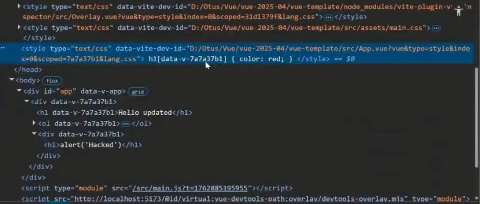

#CSS

##scoped
```
<style scoped>
</style>
```

не производительно:

Совет: используйте вместе с селекторами классов/id.
Селекторы по только имени гета в сочетании со scoped становятся ресурсозатратными

## ::v-deep
```
<style scoped>
    ::v-deep(h1){
        color: #f00;
    }
</style>
```
Будет распространяться и на динамически добавляемую разметку

## v-bind
интер
```
<script>
    const theme = {
        textColor: 'red'
    }
</script>
<style>
    .container{
        color: v-bind('theme.textColor');
    }
</style>
```

##CSS модули
```
<script setup lang="ts">
import { useCssModule } from 'vue'

const classes = useCssModule()
</script>

<template>
  <p :class="classes.red">red</p>
</template>

<style module>
.red {
  color: red;
}
</style>
```


