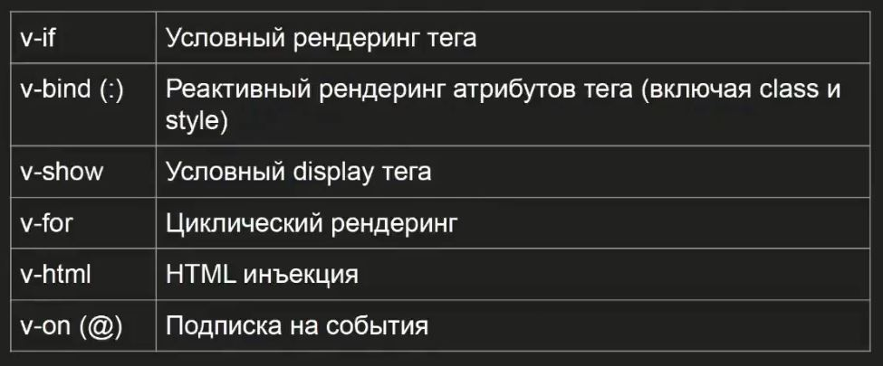

#Директивы:


### v-if v-else
```
    const show = true;
    <span v-if="show">123</span>
    <span v-else>456</span>
```
удяляет разметку из дерева

### v-show
```
    const show = true;
    <span v-show="1">1</span>
    <span v-show="2">2</span>
```
display:none;

### v-bind или просто :
связывание, например, атрибута с реактивностью
```
    <template>
        <div v-bind:data-text="{{text}}"></div>
    </tempalte>
```
Связывание стилей:
```
<script setup>
    import { ref } from "vue";
    const color = ref("red");
    const headerClass = ref("r");

    function change() {
      color.value = "green";
    }
</script>
<template>
  <div>
    <h1
      @click="change()"
    >
      Заголовок
    </h1>
  </div>
</template>
<style scoped>
    h1 {
      color: v-bind("color");
    }
</style>

```


### v-on или просто @
связывание, напрмиер, атрибута  с реактивностью
```
    <template>
        <div @click="change()"></div>
    </tempalte>
```

### v-for
связывание, напрмиер, атрибута  с реактивностью
```
    <script>
        const names = reactive(["Jonh", "Kate", "Mike"]);
    </script>
    <template>
        <ol>
            <li v-for="item in mames">{{item}}</li>
        </ol>
        <ol>
            <li v-for="(item, i) in mames">{{i}} - {{item}}</li>
        </ol>
    </tempalte>
```

:key для помощи vue
Индекс использовать нельзя!
```
    <script>
        const names = reactive(["Jonh", "Kate", "Mike"]);
    </script>
    <template>
        <ol>
            <li v-for="item in mames" :key="item">{{item}}</li>
        </ol>
    </tempalte>
```

### v-html
чтобы выводить именно Html, а не строку
```
    <script>
        const html = '<div><b>html</b></div>'
    </script>
    <template>
        <div v-html="html"></div>
    </tempalte>
```
Нужен контейнер, див итд


### v-model
Для форм, упрощает жизнь  
Было:
```
<p>Сообщение: {{ message }}</p>
<input
  :value="message"
  @input="event => message = event.target.value"
>
```

Стало:
```
<p>Сообщение: {{ message }}</p>
<input v-model="message" placeholder="отредактируй меня" />
```
то есть получаем значение из поля без доп действий


#### Модификаторý v-model
- `v-model.lazy` – запись значения в модель по событию
@change вместо @input
- `v-model.number` – пытается привести ввод пользователя к типу
Number (для приведения используется parseFloat()).
Не занимается валидацией!
- `v-model.trim` – обрезает пробелы с начала и конца
введенной строки


#### Несколþко v-model, Vue 3.4+
используем `defineModel`
```
<script setup>
    const firstName = defineModel('firstName')
    const secondName = defineModel('secondtName')
</script>
<template>
    <input
    type="text" v-model="firstName"
    />
    <input
    type="text" v-model="secondName"
    />
</template>
```


#### v-model на собственнýх компонентах


### v-slot или просто \#
1. Нужен для именованных слотов, что куда идет:
```
    <!-- Дочерний компонент BaseLayout.vue -->
    <template>
    <div class="container">
        <header>
            <slot name="header"></slot>
        </header>
        <main>
        <slot></slot>  <!-- default slot -->
        </main>
        <footer>
        <slot name="footer"></slot>
        </footer>
    </div>
    </template>

    <!-- Родительский компонент -->
    <BaseLayout>
    <template #header>
        <h1>Мой заголовок</h1>
    </template>
    
    <p>Основной контент</p>  <!-- Попадет в default slot -->
    
    <template #footer>
        <p>Копирайт 2024</p>
    </template>
    </BaseLayout>
```


